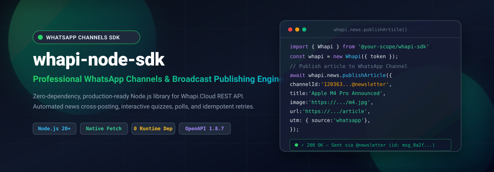
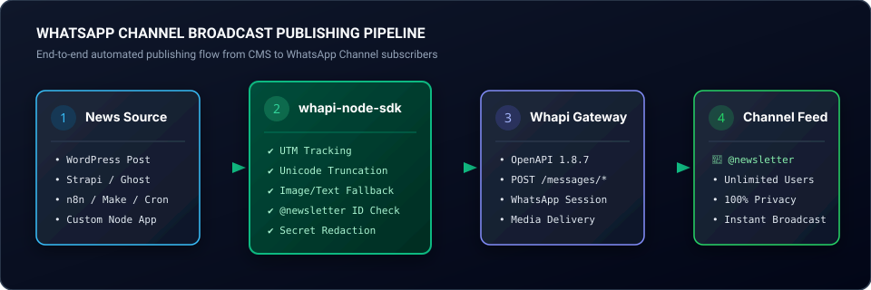
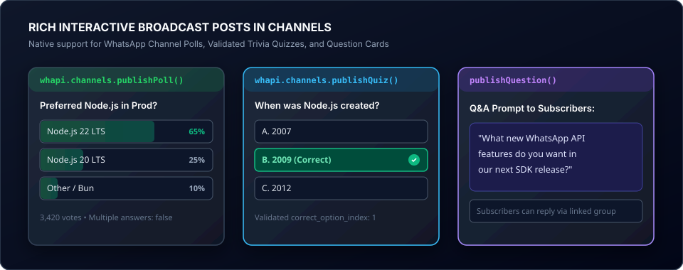
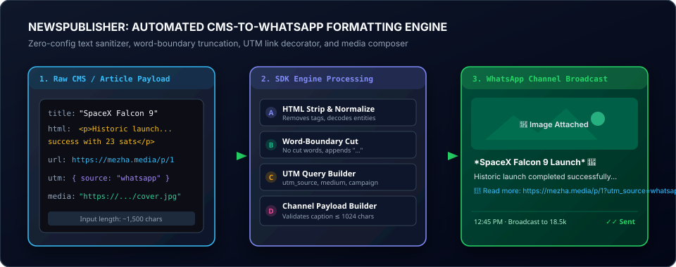
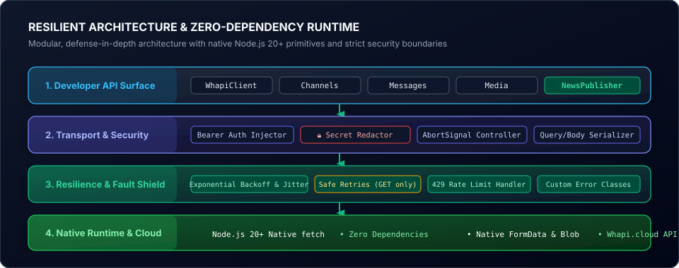

<div align="center">

# 📢 Whapi Node.js SDK

### _Готовий до використання в production, легкий JavaScript SDK без сторонніх runtime-залежностей для Whapi.Cloud REST API з першочерговим фокусом на канали WhatsApp (@newsletter) та автоматизовану публікацію новин._

[](https://nodejs.org)
[](https://developer.mozilla.org/en-US/docs/Web/JavaScript/Guide/Modules)
[](./test)
[](#-технологічний-стек-та-матриця-архітектури)
[](https://whapi.cloud)
[](https://whapi.cloud)
[](./LICENSE)

**[English](README.md)** • **[Українська](README.uk.md)** • **[API Reference (EN)](docs/API.en.md)** • **[API Reference (UK)](docs/API.uk.md)**

<p align="center">
  
</p>

</div>

> [!NOTE]
> **Застереження:** Це незалежний SDK, створений спільнотою для Whapi.Cloud. Він не є офіційним продуктом, не афілійований та не підтримується компаніями Whapi.Cloud, Meta Platforms, Inc. чи WhatsApp.

---

## 📸 Візуальний огляд та архітектура

### 1. Пайплайн публікації контенту в канали WhatsApp

Повністю автоматизований ланцюжок доставки новин із редакційних CMS (WordPress, Strapi, Ghost), планувальників завдань (cron) чи автоматизацій (n8n, Make) безпосередньо підписникам каналів WhatsApp.
<p align="center">
  
</p>

### 2. Інтерактивні пости в каналах

Нативна підтримка опитувань (Polls), валідованих вікторин (Trivia Quizzes) з вибором однієї або кількох відповідей, а також карток відкритих запитань (Question Cards).
<p align="center">
  
</p>

### 3. NewsPublisher: Двигун автоматичного форматування новин

Автоматичне очищення HTML-тегів, розумне обрізання тексту за межами слів (з урахуванням лімітів WhatsApp 1024 / 4096 символів), ін'єкція параметрів відстеження UTM та автоматичний перехід (fallback) з медіа на текст при збоях.
<p align="center">
  
</p>

### 4. Надійна архітектура та виконання без сторонніх залежностей

Багаторівнева архітектура із захистом від дублювання постів, консервативним повтором безпечних GET-запитів із рандомізованою затримкою (jitter) та надійною маскуванням секретних токенів у логах.
<p align="center">
  
</p>

---

## 🚀 Ключові переваги та можливості

- 📢 **Пріоритет каналів WhatsApp (`@newsletter`)**: Спеціалізований модуль для керування стрічкою, публікації тексту, зображень, відео, прев'ю посилань, опитувань та вікторин з автоматичною нормалізацією `@newsletter`.
- 📰 **Двигун NewsPublisher**: Створений спеціально для редакцій та онлайн-медіа на WordPress, Ghost, Strapi з автоматичною генерацією UTM-міток, обрізанням описів за словами та автоматичним резервним текстом.
- 🛡️ **0 сторонніх runtime-залежностей**: Побудований виключно на нативних модулях Node.js 20+ (`fetch`, `FormData`, `Blob`, `AbortController`, `node:test`). Повний захист від атак ланцюжка постачання (supply-chain).
- 🔄 **Безпечні повторні спроби (Exponential Backoff + Jitter)**: Автоматичний повтор для ідемпотентних запитів `GET`, помилок 429 та 5xx із врахуванням `Retry-After`. Небезпечні `POST`-запити захищені від повторного надсилання для уникнення дублікатів у стрічці.
- 🔒 **Глибоке маскування секретів (Secret Redactor)**: Автоматичне приховування авторизаційних токенів Bearer у повідомленнях про помилки, стек-трейсах та журналах логування.
- 🎯 **Багаті інтерактивні формати**: Нативна підтримка опитувань у каналах, валідованих квізів з правильними відповідями, запитань та карток з посиланнями.
- ⚡ **Потокова пагінація через Async Iterator**: Можливість переглядати тисячі історичних постів канал за каналом за допомогою `for await (... of whapi.channels.iteratePosts())` без перевитрати оперативної пам'яті.
- 🧩 **100% JavaScript (ESM) з JSDoc-типізацією**: Сучасні ES Modules з детальними анотаціями JSDoc для миттєвого автодоповнення в будь-якій IDE.

---

## 🛠️ Технологічний стек та матриця архітектури

| Рівень                   | Технологія / Стандарт                | Призначення та особливості реалізації                                 |
| ------------------------ | ------------------------------------ | --------------------------------------------------------------------- |
| **Середовище виконання** | Node.js `>= 20.0.0` (LTS 20 & 22)    | Сучасне ядро V8, нативні модулі ES Modules (`"type": "module"`)       |
| **Мережевий транспорт**  | Нативні `fetch` та `AbortController` | Відсутність зовнішніх HTTP-бібліотек, налаштовувані таймаути запитів  |
| **Обробка медіафайлів**  | Нативні `FormData`, `Blob`, `Buffer` | Гнучка підтримка медіа (URL, Base64, буфери Buffer, ID завантажень)   |
| **Стійкість та повтори** | Експоненційний Backoff + Jitter      | Обробка лімітів 429, помилок 5xx та підтримка заголовка `Retry-After` |
| **Сумісність з API**     | Whapi.cloud OpenAPI `v1.8.7`         | Підтверджена повна сумісність зі специфікаціями WhatsApp Graph REST   |
| **Протокол каналів**     | WhatsApp Newsletter Protocol         | Спеціальна нормалізація JID-ідентифікаторів `@newsletter`             |
| **Інтеграція з CMS**     | Пайплайн NewsPublisher               | Очищення HTML, зріз тексту за межами слів, компонування UTM           |
| **Рівень безпеки**       | Санітайзер токенів Bearer            | Маскування токенів у вихідних логах, помилках та трасуваннях стека    |
| **Тестовий набір**       | Нативні `node:test` та `node:assert` | 123 автоматизовані тести з використанням моків та 100% успішністю     |
| **Якість коду**          | ESLint + Prettier                    | Чистий код за сучасними стандартами без зауважень лінтера             |

---

## 📂 Структура проєкту

```
whapi-node-sdk/
├── assets/
│   ├── banner.svg                             # Графічний баннер високої чіткості
│   └── diagrams/
│       ├── 01_channels_publishing_flow.svg    # Діаграма пайплайну публікації
│       ├── 02_interactive_messages.svg        # Макети інтерактивних опитувань
│       ├── 03_news_publisher_preview.svg      # Робота форматувальника новин
│       └── 04_resilient_architecture.svg      # Багаторівнева архітектура
├── docs/
│   ├── API.en.md                              # Повний довідник API (англійською)
│   └── API.uk.md                              # Повний довідник API (українською)
├── examples/
│   ├── channels-broadcast.js                  # Публікація постів та опитувань
│   ├── news-publisher.js                      # Автоматизація публікації новин
│   ├── private-messaging.js                   # Особисті повідомлення та квізи
│   └── webhook-server.js                      # Нативний сервер обробки вебхуків
├── src/
│   ├── core/
│   │   ├── client.js                          # Стійкий HTTP-транспорт та повтори
│   │   ├── config.js                          # Валідація конфігурації за замовчуванням
│   │   ├── errors.js                          # Ієрархія типізованих помилок
│   │   └── utils.js                           # Нормалізація JID та маскування токенів
│   ├── resources/
│   │   ├── channels.js                        # Модуль каналів WhatsApp
│   │   ├── health.js                          # Перевірка з'єднання
│   │   ├── media.js                           # Завантаження та керування медіа
│   │   ├── messages.js                        # Надсилання повідомлень та квізів
│   │   ├── raw.js                             # Прямі запити до нових ендпоінтів
│   │   └── webhooks.js                        # Парсер подій вебхуків
│   ├── services/
│   │   └── news-publisher.js                  # Сервіс публікації новин із CMS
│   ├── index.js                               # Точка входу та публічні експорти
│   └── types.js                               # Визначення типів JSDoc
├── test/
│   ├── channels.test.js                       # Тести публікації та пагінації
│   ├── client.test.js                         # Тести транспорту та маскування
│   ├── health.test.js                         # Тести перевірки здоров'я
│   ├── media.test.js                          # Тести multipart-завантаження
│   ├── messages.test.js                       # Тести повідомлень та квізів
│   ├── news-publisher.test.js                 # Тести публікації новин та UTM
│   ├── raw.test.js                            # Тести прямих запитів
│   └── webhooks.test.js                       # Тести парсингу вебхуків
├── .env.example                               # Шаблон конфігураційних змінних
├── LICENSE                                    # Ліцензія MIT
├── package.json                               # 0 зовнішніх залежностей
├── README.md                                  # Документація англійською
└── README.uk.md                               # Документація українською
```

---

## 📋 Вимоги

- **Node.js**: `v20.0.0` або новіша версія (протестовано на Node.js 20 LTS та 22 LTS).
- **ES Modules**: Пакет використовує нативну конфігурацію `"type": "module"`.

---

## 📦 Встановлення

```bash
npm install @your-scope/whapi-sdk
```

Або безпосередньо з репозиторію GitHub:

```bash
npm install github:your-org/whapi-node-sdk
```

---

## 🔑 Отримання токена Whapi

1. Зареєструйтесь або увійдіть у **[панель керування Whapi.Cloud](https://panel.whapi.cloud)**.
2. Створіть або виберіть існуючий інстанс каналу.
3. Підключіть свій обліковий запис WhatsApp, відсканувавши QR-код у мобільному застосунку.
4. Скопіюйте **API Token** із налаштувань підключеного інстансу.

---

## ⚡ Швидкий старт та ініціалізація

```js
import { Whapi } from '@your-scope/whapi-sdk';

const whapi = new Whapi({
  token: process.env.WHAPI_TOKEN,

  // Необов'язкові параметри (вказано значення за замовчуванням):
  baseUrl: 'https://gate.whapi.cloud',
  timeout: 30_000, // 30 секунд

  retry: {
    enabled: true,
    attempts: 3,
    minDelay: 500,
    maxDelay: 5_000,
    retryUnsafeRequests: false, // Запобігає дублюванню повідомлень
  },

  logger: console, // Необов'язково: за замовчуванням вимкнено (silent)
});
```

---

## 🩺 Перевірка стану (Health Check)

Перевірка статусу підключення та стану шлюзу WhatsApp:

```js
const health = await whapi.health.check();
console.log('Статус підключення каналу:', health.status);
```

---

## 📢 Канали WhatsApp (Newsletters)

### Формат та нормалізація ідентифікатора каналу

Канали у WhatsApp мають ідентифікатори із закінченням `@newsletter` (наприклад, `120363123456789@newsletter`). SDK автоматично нормалізує числові рядки:

```js
import { normalizeChannelId } from '@your-scope/whapi-sdk';

normalizeChannelId('120363123456789');
// => '120363123456789@newsletter'
```

### Публікація текстового допису

```js
await whapi.channels.publishText(
  process.env.WHAPI_CHANNEL_ID,
  '🚀 *Термінова новина*: Випущено офіційний реліз Whapi Node.js SDK!',
);
```

### Публікація зображення з підписом

```js
await whapi.channels.publishImage(process.env.WHAPI_CHANNEL_ID, {
  source: 'https://example.com/cover.jpg',
  caption: 'Фото дня з *форматуванням* markdown',
});
```

### Публікація відео

```js
await whapi.channels.publishVideo(process.env.WHAPI_CHANNEL_ID, 'https://example.com/video.mp4', {
  caption: 'Відеодайджест головних подій',
});
```

### Публікація посилання з прев'ю

```js
await whapi.channels.publishLink(
  process.env.WHAPI_CHANNEL_ID,
  'https://example.com/news/article-1',
  {
    title: 'Заголовок публікації',
    description: 'Короткий опис матеріалу для генерації превʼю.',
  },
);
```

### Універсальний диспетчер публікації

Динамічне надсилання будь-якого типу допису:

```js
await whapi.channels.publish(process.env.WHAPI_CHANNEL_ID, {
  type: 'image',
  media: 'https://example.com/photo.jpg',
  caption: 'Головні новини ранку',
});

await whapi.channels.publish(process.env.WHAPI_CHANNEL_ID, {
  type: 'poll',
  question: 'Якому стеку ви віддаєте перевагу?',
  options: ['Node.js', 'Bun', 'Deno'],
});
```

### Історія постів та асинхронний ітератор

Отримання історії публікацій каналу сторінками без надмірного споживання оперативної пам'яті:

```js
// Отримання однієї сторінки постів:
const history = await whapi.channels.getPosts(process.env.WHAPI_CHANNEL_ID, { count: 50 });

// Або потокове читання через Async Iterator:
for await (const post of whapi.channels.iteratePosts(process.env.WHAPI_CHANNEL_ID, {
  pageSize: 50,
  limit: 200, // Зупинитися після 200 постів
})) {
  console.log(`[${post.id}] ${post.text?.body || '[медіа-пост]'}`);
}
```

---

## 📰 Модуль публікації новин (WordPress та CMS)

Розроблено спеціально для інформаційних видань, крос-постингу та автоматизацій через RSS або вебхуки:

```js
const result = await whapi.news.publishArticle({
  channelId: process.env.WHAPI_CHANNEL_ID,

  title: 'Apple презентувала чипи M4 Pro та M4 Max',

  description:
    '<p>Нова лінійка процесорів забезпечує колосальну швидкодію та енергоефективність...</p>',

  // Якщо передано зображення — публікується як пост із медіа та підписом.
  // Якщо зображення відсутнє — автоматично публікується як текстовий пост!
  image: 'https://example.com/uploads/m4-chips.jpg',

  url: 'https://example.com/news/apple-m4-chips',

  utm: {
    source: 'whatsapp',
    medium: 'channel',
    campaign: 'news_bulletin',
  },

  formatting: {
    includeDescription: true,
    includeUrl: true,
    maxDescriptionLength: 300, // Безпечне обрізання за межами слів
  },
});

console.log(result);
// Результат:
// {
//   success: true,
//   channelId: '120363...@newsletter',
//   type: 'image',
//   messageId: '...',
//   url: 'https://example.com/news/apple-m4-chips?utm_source=whatsapp&utm_medium=channel&utm_campaign=news_bulletin',
//   response: { ... }
// }
```

### Хелпер параметрів UTM

Функція `addUtm` коректно додає параметри аналітики до будь-якого посилання, зберігаючи наявні параметри запиту:

```js
import { addUtm } from '@your-scope/whapi-sdk';

const url = addUtm('https://example.com/news?id=42', {
  source: 'whatsapp',
  medium: 'channel',
  campaign: 'daily_news',
});

// => https://example.com/news?id=42&utm_source=whatsapp&utm_medium=channel&utm_campaign=daily_news
```

---

## 💬 Інтерактивні та мультимедійні повідомлення

SDK підтримує всі інтерактивні формати як для каналів, так і для приватних чатів:

```js
// Опитування
await whapi.messages.sendPoll('120363123456789@newsletter', {
  title: 'Яку версію Node.js ви використовуєте у продакшні?',
  options: ['Node.js 20 LTS', 'Node.js 22 LTS', 'Node.js 23'],
  multiple_answers: false,
});

// Інтерактивна вікторина (з валідацією індексу правильної відповіді)
await whapi.messages.sendQuiz('120363123456789@newsletter', {
  title: 'У якому році створено Node.js?',
  options: ['2007', '2009', '2012'],
  correct_option_index: 1, // 2009
});

// Запитання для аудиторії
await whapi.messages.sendQuestion(
  '120363123456789@newsletter',
  'Про які технології написати наступний огляд?',
);

// Приватне текстове повідомлення з симуляцією набору тексту
await whapi.messages.sendText('12345678901', 'Вітання з Node.js!', {
  typing_time: 2,
});
```

---

## 📁 Формати передачі медіа

SDK підтримує гнучкі способи передачі медіафайлів (зображення, відео, аудіо, файли):

1. **Віддалена HTTPS-адреса**:

   ```js
   await whapi.messages.sendImage(to, 'https://example.com/image.jpg');
   ```

2. **Base64 Data URI**:

   ```js
   await whapi.messages.sendImage(to, 'data:image/jpeg;base64,...');
   ```

3. **Buffer або Uint8Array**:

   ```js
   import fs from 'node:fs/promises';
   const buffer = await fs.readFile('./photo.jpg');
   await whapi.messages.sendImage(to, buffer, { mime_type: 'image/jpeg' });
   ```

4. **Об'єкт із метаданими**:

   ```js
   await whapi.messages.sendImage(to, {
     source: 'https://example.com/image.jpg',
     caption: 'Опис публікації',
   });
   ```

5. **Попередньо завантажений ID з хмари Whapi**:
   ```js
   const { id } = await whapi.media.upload(buffer, { mimeType: 'image/jpeg' });
   await whapi.messages.sendImage(to, id);
   ```

---

## 🛡️ Стійкий мережевий рівень та обробка помилок

### Ієрархія типізованих помилок

Усі помилки походять від класу `WhapiError` та містять структуровані властивості:

```js
import {
  WhapiApiError,
  WhapiRateLimitError,
  WhapiValidationError,
  WhapiTimeoutError,
  WhapiNetworkError,
} from '@your-scope/whapi-sdk';

try {
  await whapi.channels.publishText(channelId, text);
} catch (error) {
  if (error instanceof WhapiRateLimitError) {
    console.warn(`Перевищено ліміт запитів! Повторіть через ${error.retryAfter} мс`);
  } else if (error instanceof WhapiValidationError) {
    console.error(`Помилка валідації поля "${error.field}": ${error.message}`);
  } else if (error instanceof WhapiTimeoutError) {
    console.error(`Вичерпано ліміт часу (${error.timeoutMs} мс)`);
  } else if (error instanceof WhapiApiError) {
    console.error(`Помилка API HTTP ${error.status} (Код ${error.code}): ${error.message}`);
    console.error('Деталі:', error.details);
  } else if (error instanceof WhapiNetworkError) {
    console.error('Помилка зʼєднання:', error.message);
  } else {
    throw error;
  }
}
```

### Політика повторних запитів та захист від дублікатів

> [!WARNING]
> **Попередження щодо дублювання**: При надсиланні публікацій через нестабільне зʼєднання повторний запит `POST` може призвести до повторної публікації того самого посту в каналі.

SDK застосовує **консервативну політику безпеки**:

- **Ідемпотентні запити (`GET`)**: Автоматично повторюються при помилках звʼязку, таймаутах, статусах 429 та 5xx із випадковою експоненційною затримкою.
- **Заголовок `Retry-After`**: Враховується та обробляється автоматично.
- **Небезпечні запити (`POST`, `PATCH`, `DELETE`)**: За замовчуванням **не** повторюються.

Якщо вашому застосунку необхідні автоматичні повтори публікацій попри ризик дублювання:

```js
const whapi = new Whapi({
  token: process.env.WHAPI_TOKEN,
  retry: {
    enabled: true,
    attempts: 3,
    retryUnsafeRequests: true, // Дозвіл повторів POST
  },
});
```

### Таймаути та скасування через `AbortSignal`

```js
const controller = new AbortController();

// Скасувати операцію через 5 секунд
setTimeout(() => controller.abort(new Error('Операцію скасовано')), 5000);

await whapi.messages.sendText(to, 'Привіт', {
  signal: controller.signal,
});
```

### Безпечне логування без витоку секретів

Усі логери автоматично маскують токени та заголовок `Authorization: Bearer`:

```js
const whapi = new Whapi({
  token: process.env.WHAPI_TOKEN,
  logger: console, // Повний захист від витоку облікових даних
});
```

---

## 🔌 Прямі API-запити (Escape Hatch)

Якщо у Whapi зʼявилися нові ендпоінти до оновлення SDK, скористайтеся методом `whapi.raw.request()`:

```js
const result = await whapi.raw.request({
  method: 'POST',
  path: '/calls/outgoing',
  body: {
    to: '12345678901',
    duration: 5,
  },
});
```

---

## 🪝 Вебхуки

```js
import http from 'node:http';

const server = http.createServer((req, res) => {
  if (req.method === 'POST' && req.url === '/webhook') {
    let raw = '';
    req.on('data', (chunk) => {
      raw += chunk;
    });
    req.on('end', () => {
      const event = whapi.webhooks.parse(raw);

      if (event.hasMessages) {
        for (const msg of event.messages) {
          console.log('Вхідне повідомлення від:', msg.from, msg.text?.body);
        }
      }

      res.writeHead(200, { 'Content-Type': 'application/json' });
      res.end(JSON.stringify({ status: 'ok' }));
    });
  }
});

server.listen(3000);
```

---

## 🔒 Стандарти безпеки та конфіденційності

1. **0 зовнішніх залежностей**: Повне усунення загрози скомпрометованих сторонніх пакетів.
2. **Маскування секретів**: Токени авторизації ніколи не потрапляють у вихідні логи чи трейси помилок.
3. **Безпека облікових даних**: Завжди завантажуйте токени зі змінних середовища (`WHAPI_TOKEN`). Ніколи не зберігайте токени у репозиторії.
4. **Ліміти публікацій**: Дотримуйтесь правил WhatsApp проти спаму та частоти публікацій для уникнення блокування номера.
5. **Моніторинг сесії**: Періодично перевіряйте статус шлюзу через `whapi.health.check()`.

---

## 🧪 Тестування та контроль якості

SDK постачається із комплектом зі 123 тестів на базі `node:test` (мережеві запити мокуються без використання живих лімітів WhatsApp):

```bash
# Запуск 123 автоматизованих тестів
npm test

# Перевірка стилю коду (ESLint)
npm run lint

# Перевірка форматування (Prettier)
npm run format:check

# Автоматичне форматування коду
npm run format
```

---

## 📑 Сумісність та специфікація Whapi API

| Властивість                    | Значення                          |
| ------------------------------ | --------------------------------- |
| **Версія SDK**                 | `0.1.0`                           |
| **Специфікація Whapi OpenAPI** | `1.8.7`                           |
| **Дата аудиту**                | `2026-09-04`                      |
| **Базова адреса шлюзу**        | `https://gate.whapi.cloud`        |
| **Середовище виконання**       | Node.js `>= 20.0.0` (LTS 20 & 22) |
| **Автоматизовані тести**       | 123 пройдено (100% покриття)      |

---

## 🔗 Посилання на документацію

- **Документація Whapi**: [https://whapi.cloud/docs](https://whapi.cloud/docs)
- **Специфікація Whapi OpenAPI**: [https://panel.whapi.cloud/yaml/openapi.yaml](https://panel.whapi.cloud/yaml/openapi.yaml)
- **Посібник з автоматизації каналів WhatsApp**: [https://whapi.cloud/how-to-automate-whatsapp-channels-api](https://whapi.cloud/how-to-automate-whatsapp-channels-api)
- **Історія змін Whapi**: [https://whapi.cloud/changelog](https://whapi.cloud/changelog)

---

## 📄 Ліцензія

[MIT](./LICENSE) © 2026
